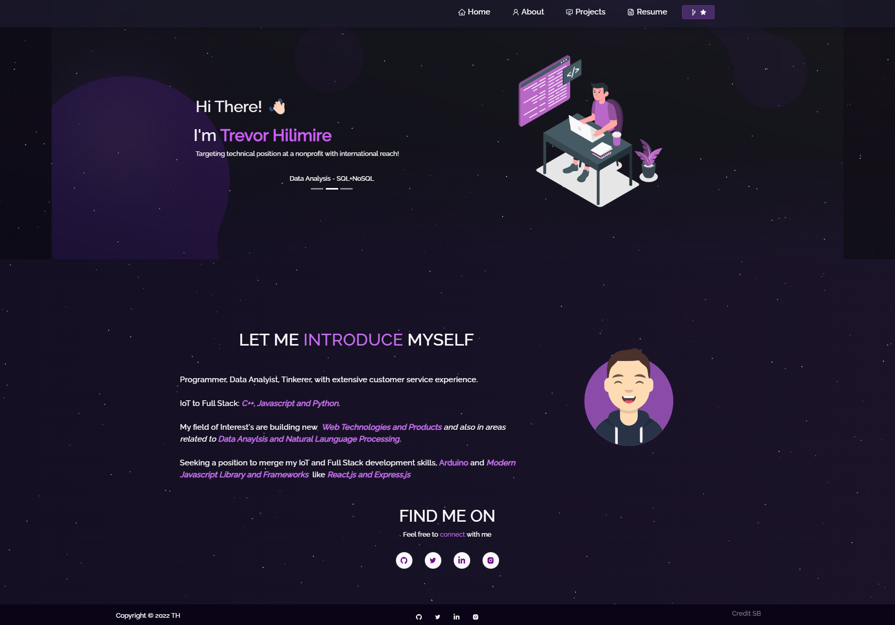
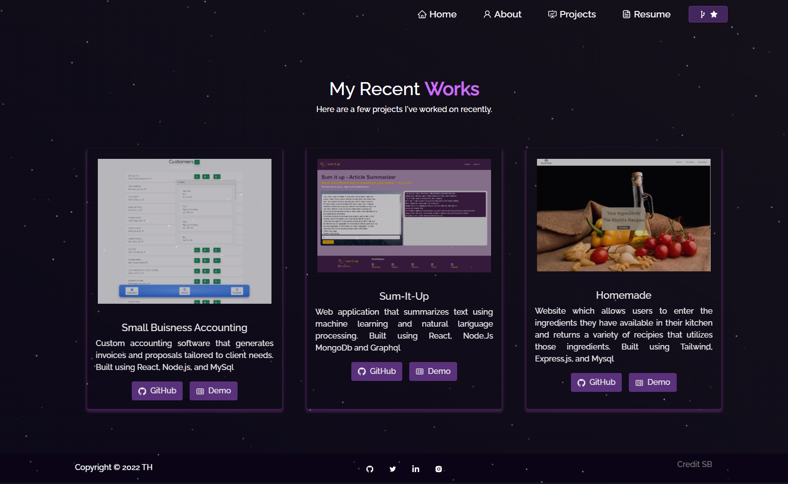
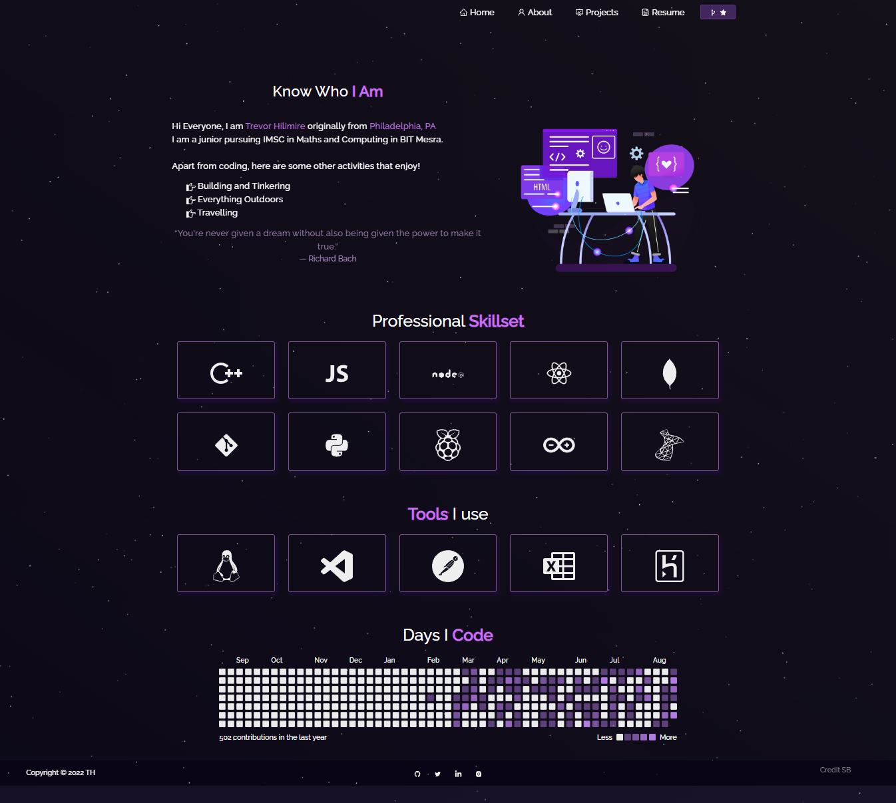

# Portfolio 


## Description

A React built portfolio to showcase my skills and projects

## Table of Contents

* [Installation](#installation) 
* [Usage](#usage) 
* [License](#license) 
* [Credits](#credits) 


## Installation
To install necessary dependencies, run the following command:
  ```
  npm i in root directory
  ```

## Usage

Install packages in root directory and run npm start to lauch



## Features

- React built
- Linked to Github showing days spent coding
- React-Pdf for viewing and downloading CV

## License
License that explains which license the application is covered under:
This project is licensed under the GNUGPLv3 -lets people do almost anything they want with your project, except distributing closed source versions license.

## Credits
If you like the template please checkout soumyajit4419!
https://github.com/soumyajit4419

## Questions

If you have any questions about the repo, open an issue or contact me directly at trevorHilimire@gmail.com
This project was created by Github user: [Trv893](https://github.com/trv893/)


